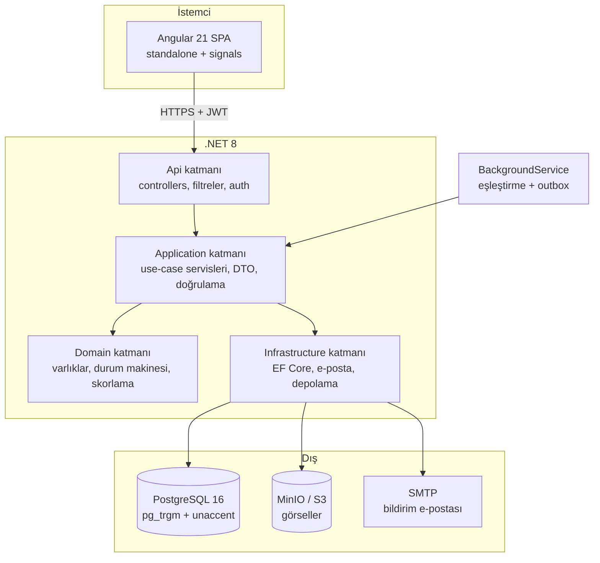
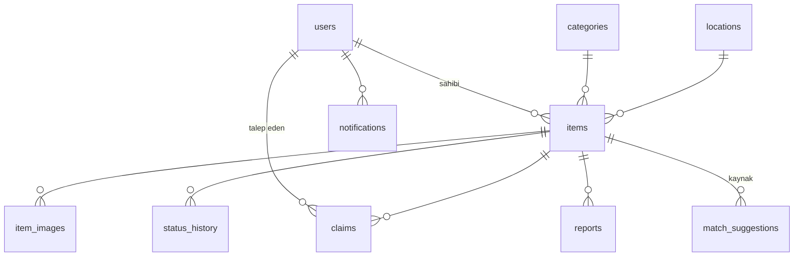
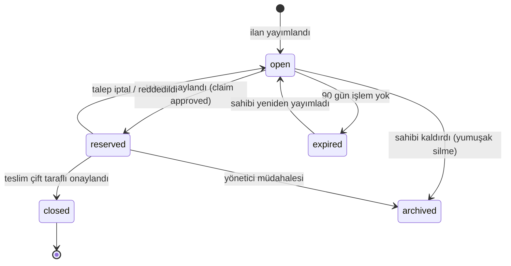
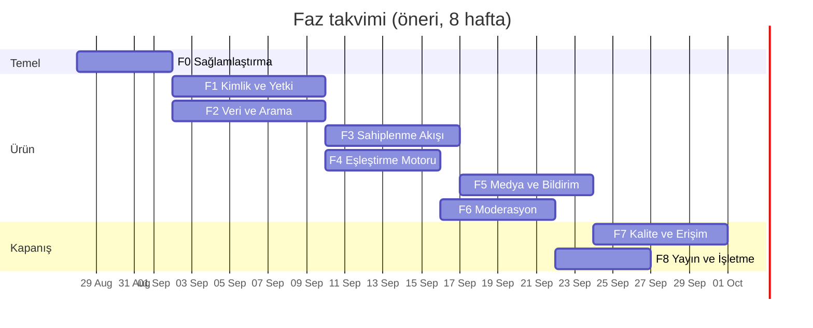

# Kampüs Kayıp Eşya Platformu — Yol Haritası

**Kurum:** Aksaray Üniversitesi · **Yığın:** Angular 21 + .NET 8 (ASP.NET Core) + PostgreSQL 16
**Depo:** https://github.com/safacenkci/kampus-kayip-esya
**Doküman sürümü:** 1.0 · **Tarih:** 2026-08-27

> Bu doküman çok ajanlı çalışma için yazıldı. Her görevin kimliği (`F1-BE-02`), kulvarı,
> bağımlılıkları, dokunacağı dosyalar ve "bitti" tanımı vardır. Görev dağıtımını yapan bot
> için makine okunur kopya: [`docs/gorevler.json`](./gorevler.json).
> Ajanların uyacağı çalışma kuralları: [`docs/AJAN-PROTOKOLU.md`](./AJAN-PROTOKOLU.md).

---

## 0. Yönetici özeti

Depoda çalışan bir MVP var: Angular arayüzü, .NET API'si, PostgreSQL şeması, tohum verisi ve
canlı API'ye HTTP atan duman testleri. README'deki 9 maddelik kalite barı büyük ölçüde
karşılanmış durumda.

Ancak **"kusursuz" hedefi için MVP yeterli değil.** Üç kategoride kritik boşluk var:

1. **Güvenlik:** Kimlik doğrulama yok. Herhangi bir kişi `PATCH /api/items/{id}/status`
   çağırıp bir ilanı `claimed` yapabilir ve ardından **ilan sahibinin iletişim bilgisini
   okuyabilir**. Bu, README'nin 7. kalite maddesini fiilen geçersiz kılıyor. → `F0-SEC-01`, `F1`, `F3`
2. **İşletilebilirlik:** CI yok, `.sln` yok, prod ortam yapılandırması yok, sırlar depoda
   düz metin, sayfalama yok, gerçek entegrasyon testi yok. → `F0`, `F8`
3. **Ürün derinliği:** Sahiplenme/teslim akışı yok (durum elle değiştiriliyor), eşleştirme
   ham eşitlik kontrolü, görsel yükleme yok, bildirim yok, moderasyon yok. → `F3`–`F6`

Yol haritası 9 fazdan oluşur (`F0`–`F8`), toplam **70 görev**, tahminî **305 adam-saat**. Fazlar sırayla ilerler ama
faz içindeki kulvarlar paraleldir.

---

## 1. Mevcut durum envanteri

### 1.1 Var olan ve korunacaklar

| Alan | Durum | Dosya |
|---|---|---|
| Veri modeli | `Item` + `StatusHistory`, indeksli, iki migration | `backend/Models/`, `backend/Migrations/` |
| API | 8 uç nokta, filtreli listeleme, eşleşme, durum geçmişi | `backend/Controllers/ItemsController.cs` |
| Doğrulama | Katalog normalizasyonu (konum/kategori/tip/durum) | `backend/Models/ItemRules.cs` |
| İletişim maskesi | `status == open` iken `contact` dönmez | `backend/Models/ItemMapper.cs` |
| Tohum verisi | 6+ gerçekçi Aksaray ilanı | `backend/Data/DbSeeder.cs` |
| Arayüz | Ayrık Kaybettim/Buldum akışları, liste, detay, düzenleme, kart UI | `frontend/src/app/pages/` |
| Duman testleri | Canlı API'ye HTTP çağrısı, 9 maddeyi doğrulayan xUnit | `backend/KampusKayipEsya.Api.Tests/` |
| Veritabanı | Docker Compose PostgreSQL 16, sağlık kontrolü | `docker-compose.yml` |

### 1.2 Kapatılacak kusurlar (F0'ın girdisi)

| # | Kusur | Kanıt | Görev |
|---|---|---|---|
| K1 | **Yetkisiz durum değişikliği + iletişim sızıntısı.** Kimlik yok; `PATCH .../status` herkese açık, `claimed` sonrası `contact` listede de dönüyor | `ItemsController.cs:UpdateStatus`, `ItemMapper.cs:14` | `F0-SEC-01` |
| K2 | `UseUrls("http://localhost:5080")` koda gömülü → konteynerde/prod'da dinleyemez | `backend/Program.cs:8` | `F0-BE-01` |
| K3 | CORS origin gömülü, ProblemDetails yok, Swagger yok, sağlık kontrolü yok, hız sınırı yok, global hata yakalayıcı yok | `backend/Program.cs` | `F0-BE-01`, `F0-BE-02` |
| K4 | Veritabanı parolası depoda düz metin | `backend/appsettings.json:3` | `F0-BE-04` |
| K5 | Her açılışta `MigrateAsync` + `SeedAsync` — prod'da kontrolsüz | `backend/Program.cs:34-39` | `F0-BE-03` |
| K6 | `GET /api/items` sayfalama yok — tüm tabloyu döner | `ItemsController.cs:GetItems` | `F2-BE-03` |
| K7 | Arama `ILIKE '%q%'` — indeks kullanamaz, aksan/Türkçe karakter duyarsızlığı yok (`kutuphane` → `kütüphane`'yi bulmaz) | `ItemsController.cs:52-58` | `F2-DB-02`, `F2-BE-02` |
| K8 | Katalog değerleri Türkçe metin olarak hem kodda hem DB'de; URL'de kodlama sorunu, yeniden adlandırma imkânsız | `ItemRules.cs:24-40` | `F2-DB-01` |
| K9 | `DELETE` kalıcı siliyor; denetim izi yok | `ItemsController.cs:DeleteItem` | `F2-BE-04` |
| K10 | Eşzamanlılık kontrolü yok — son yazan kazanır | `ItemsController.cs:UpdateItem` | `F2-BE-05` |
| K11 | Kök `.sln` yok; testler canlı sürece HTTP atıyor, gerçek entegrasyon testi yok | depo kökü, `ApiProcess.cs` | `F0-INF-01`, `F0-QA-01` |
| K12 | `npm test` betiği var ama `angular.json`'da test hedefi ve test bağımlılığı yok → komut hata verir | `frontend/package.json:8`, `frontend/angular.json` | `F0-FE-01` |
| K13 | Tek `environment.ts`, `fileReplacements` yok → prod derlemesi `localhost:5080`'e bakar | `frontend/src/environments/` | `F0-FE-03` |
| K14 | ESLint yok, biçim denetimi CI'da değil | `frontend/package.json` | `F0-FE-02` |
| K15 | `ItemService` API cevabının 4-5 farklı şeklini tahmin etmeye çalışıyor — sözleşme belirsizliği işareti | `frontend/src/app/services/item.service.ts:180-230` | `F2-FE-02` |
| K16 | Erişilebilirlik doğrulanmamış, e2e testi yok | `frontend/src/app/` | `F7-FE-01`, `F7-QA-01` |
| K17 | Görsel `photoUrl` string; yükleme, boyut/tip doğrulama, EXIF temizleme yok | `Models/Item.cs:11` | `F5` |

---

## 2. Hedef mimari



### 2.1 Hedef klasör yapısı

```
KampusKayipEsya.sln
backend/
  src/
    KampusKayipEsya.Domain/          # varlıklar, değer nesneleri, kurallar, durum makinesi
    KampusKayipEsya.Application/     # use-case servisleri, DTO, FluentValidation, arayüzler
    KampusKayipEsya.Infrastructure/  # EF Core, repolar, migration, e-posta, nesne deposu
    KampusKayipEsya.Api/             # controllers, auth, middleware, OpenAPI, Program.cs
  tests/
    KampusKayipEsya.Domain.Tests/        # saf birim test (hızlı)
    KampusKayipEsya.Application.Tests/   # servis testleri
    KampusKayipEsya.Api.IntegrationTests/# WebApplicationFactory + Testcontainers
frontend/
  src/app/
    core/        # auth, http interceptor, config, guard
    shared/      # ortak bileşen, boru hattı, direktif
    features/    # ilanlar, kaybettim, buldum, talepler, hesap, yönetim
    api/         # OpenAPI'den üretilmiş tipler ve istemci
e2e/             # Playwright
docs/            # bu doküman, ADR'ler, runbook
.github/workflows/
```

> **Not:** Katmanlı yapıya geçiş `F0-INF-01`'de iskelet olarak, `F2` sonunda tam olarak
> tamamlanır. Erken fazlarda mevcut düz yapı korunabilir; kural, **yeni kodun** doğru
> katmana yazılmasıdır.

### 2.2 Teknoloji kararları (bağlayıcı)

| Konu | Karar | Gerekçe |
|---|---|---|
| Kimlik | ASP.NET Core Identity + JWT (access 15 dk) + refresh token rotasyonu (7 gün) | SSO yoksa standart, test edilebilir |
| E-posta alanı kısıtı | `@aksaray.edu.tr`, `@ogrenci.aksaray.edu.tr` | Kampüs dışı kaydı engeller |
| Hata formatı | RFC 9457 `application/problem+json`, Türkçe `detail`, `traceId` | Tek tip istemci hata işleme |
| API sürümü | Yol tabanlı `/api/v1/...` | Kırıcı değişikliği yönetmek |
| Sayfalama | `page`, `pageSize` (varsayılan 20, azami 50), zarf `{items,page,pageSize,total,totalPages}` | Basit ve önbelleklenebilir |
| Arama | `unaccent` + `pg_trgm`, üretilmiş `search_text` kolonu + GIN indeks | Türkçe aksan duyarsız, indeksli |
| Katalog | DB tablosu, ASCII `slug` + `name_tr` (`kutuphane` → "Kütüphane") | URL güvenli, yeniden adlandırılabilir |
| Eşzamanlılık | Npgsql `xmin` eşzamanlılık jetonu + `If-Match`/ETag → 409 | Kayıp güncelleme yok |
| Silme | Yumuşak silme (`deleted_at`) + `audit_log` | Denetim ve kurtarma |
| Arka plan işi | `BackgroundService` + `PeriodicTimer` + outbox tablosu | Ek altyapı gerektirmez |
| Nesne deposu | MinIO (S3 uyumlu), sunucu tarafı yeniden boyutlama (ImageSharp) | Yerelde ve bulutta aynı kod |
| Ön yüz testi | Vitest (`@angular/build:unit-test`) + Playwright e2e | Angular 21 yerel desteği |
| Günlükleme | Serilog JSON + correlation id; PII maskeli | Aranabilir, KVKK uyumlu |

---

## 3. Hedef veri modeli



| Tablo | Amaç | Faz |
|---|---|---|
| `items` | İlan (mevcut, genişletilecek: `owner_user_id`, `category_id`, `location_id`, `deleted_at`, `search_text`, `occurred_at`, `expires_at`) | F1–F2 |
| `status_history` | Durum geçmişi (mevcut, `claim_id` ve `changed_by_user_id` eklenir) | F3 |
| `users` | ASP.NET Identity kullanıcıları, `is_verified`, `suspended_until` | F1 |
| `refresh_tokens` | Rotasyon + yeniden kullanım tespiti | F1 |
| `categories`, `locations` | `slug`, `name_tr`, `sort_order`, `is_active` | F2 |
| `audit_log` | Kim, ne zaman, hangi kaydı, eski→yeni | F2 |
| `claims` | Sahiplenme talebi, kanıt notu, karar | F3 |
| `match_suggestions` | Skorlu eşleşme önbelleği | F4 |
| `item_images` | Görsel meta, thumbnail anahtarı | F5 |
| `notifications` + `outbox_messages` | Uygulama içi bildirim + e-posta kuyruğu | F5 |
| `reports` | Şikâyet/moderasyon kuyruğu | F6 |

### 3.1 İlan durum makinesi (F3 hedefi)



**Kural:** Durum yalnızca bu geçişlerle değişir. Geçersiz geçiş `409 Conflict` döner.
`contact` alanı **yalnızca** (a) ilan sahibine, (b) onaylanmış talebin sahibine, (c) `Admin`
rolüne döner. Bu kuralın regresyon testi zorunludur (`F3-QA-01`).

---

## 4. Faz planı



| Faz | Ad | Amaç | Çıkış kriteri |
|---|---|---|---|
| **F0** | Sağlamlaştırma | Teknik borcu kapat, CI kur | CI yeşil, `dotnet test` + `npm test` + `npm run lint` tek komutla çalışıyor, sırlar depoda değil |
| **F1** | Kimlik & Yetki | Kampüs e-postasıyla hesap, sahiplik | Yalnız sahibi kendi ilanını düzenleyebiliyor; yetkisiz `PUT`/`PATCH`/`DELETE` 401/403 |
| **F2** | Veri & Arama | Ölçeklenebilir liste ve arama | 10.000 kayıtla liste p95 < 300 ms; `kutuphane` araması `kütüphane` ilanlarını buluyor |
| **F3** | Sahiplenme akışı | Gerçek teslim süreci | İletişim yalnız onaylı taraflar arasında açılıyor; sızıntı testi geçiyor |
| **F4** | Eşleştirme motoru | Akıllı öneri | Skorlu eşleşme + gerekçe; ≥75 skorda bildirim üretiliyor |
| **F5** | Medya & bildirim | Fotoğraf ve haberleşme | 3 görsele kadar yükleme, EXIF temiz; e-posta + uygulama içi bildirim |
| **F6** | Moderasyon | Kötüye kullanımla başa çıkma | Şikâyet kuyruğu, yönetim paneli, otomatik arşiv |
| **F7** | Kalite | Kanıtlanmış kalite | e2e yeşil, WCAG 2.2 AA, Lighthouse ≥90, kapsam eşikleri tutuyor |
| **F8** | Yayın | Çalışır sistem | Tek komutla ayağa kalkan prod yığını, yedek + runbook + KVKK metinleri |

---

## 5. Görev kartları

Kart biçimi: **Kimlik · Kulvar · Bağımlılık · Tahmin · Yapılacak · Dosyalar · Bitti tanımı (BT)**
Kulvarlar: `BE` backend · `FE` frontend · `DB` veri · `INF` altyapı/CI · `QA` test · `SEC` güvenlik · `DOC` doküman

---

### F0 — Sağlamlaştırma (14 görev · ~5 gün)

#### `F0-INF-01` — Çözüm dosyası ve derleme standartları
**Kulvar** INF · **Bağımlılık** — · **Tahmin** 2 sa
Kökte `KampusKayipEsya.sln` oluştur; API ve test projelerini ekle. `Directory.Build.props` ile
`TreatWarningsAsErrors=true`, `Nullable=enable`, `LangVersion=latest`, `EnforceCodeStyleInBuild=true`.
Kökte C# için `.editorconfig` (4 boşluk, `file_scoped_namespace`, `dotnet_diagnostic.CA*` seviyeleri).
**Dosyalar** `KampusKayipEsya.sln`, `Directory.Build.props`, `.editorconfig`
**BT** Kökte `dotnet build` ve `dotnet test` uyarısız geçiyor; uyarı derlemeyi kırıyor.

#### `F0-INF-02` — Backend CI iş akışı
**Kulvar** INF · **Bağımlılık** `F0-INF-01` · **Tahmin** 3 sa
`.github/workflows/ci-backend.yml`: `push`/`pull_request` tetikleyicisi, `postgres:16` servis
konteyneri (sağlık kontrollü), `actions/setup-dotnet@v4` (8.0.x), NuGet önbelleği,
`dotnet restore/build --no-restore/test --no-build --logger trx --collect:"XPlat Code Coverage"`.
Test sonuçlarını ve kapsamı iş özeti olarak yayımla.
**Dosyalar** `.github/workflows/ci-backend.yml`
**BT** PR'da iş yeşil; kasıtlı bozuk test PR'ı kırmızıya düşürüyor (kanıt: bir kez denenmiş).

#### `F0-INF-03` — Frontend CI iş akışı
**Kulvar** INF · **Bağımlılık** `F0-FE-01`, `F0-FE-02` · **Tahmin** 2 sa
`.github/workflows/ci-frontend.yml`: Node 22, `npm ci`, `npm run lint`, `npm run format:check`,
`npm test -- --run`, `npm run build -- --configuration production`. npm önbelleği açık.
**Dosyalar** `.github/workflows/ci-frontend.yml`
**BT** Dört adım da yeşil; derleme çıktısı bütçeleri aşmıyor.

#### `F0-INF-04` — Katkı kuralları ve PR hijyeni
**Kulvar** INF · **Bağımlılık** — · **Tahmin** 2 sa
`.github/pull_request_template.md` (özet, kapsam, test kanıtı, ekran görüntüsü, kontrol listesi),
`.github/CODEOWNERS`, `CONTRIBUTING.md` (dal adlandırma, commit biçimi, kulvar sahipliği),
`.github/ISSUE_TEMPLATE/` (hata + görev). Dal koruma ayarları `CONTRIBUTING.md`'de belgelenir.
**Dosyalar** `.github/**`, `CONTRIBUTING.md`
**BT** Yeni PR açıldığında şablon otomatik geliyor.

#### `F0-BE-01` — Program.cs üretim seviyesine çekilir
**Kulvar** BE · **Bağımlılık** `F0-INF-01` · **Tahmin** 4 sa
`UseUrls` çağrısını sil (`ASPNETCORE_URLS` kullanılacak). CORS izinli kaynakları
`Cors:AllowedOrigins` yapılandırmasından oku. Ekle: `AddProblemDetails()`,
`UseExceptionHandler()`, Swashbuckle ile OpenAPI (`/swagger` yalnız Development),
`AddHealthChecks().AddNpgSql()` → `/health/live` ve `/health/ready`, Serilog (JSON, correlation id),
`AddApiVersioning()` ile `/api/v1` öneki, `ForwardedHeaders` (ters vekil arkası için).
**Dosyalar** `backend/Program.cs`, `backend/appsettings*.json`, `backend/KampusKayipEsya.Api.csproj`
**BT** `ASPNETCORE_URLS=http://0.0.0.0:8080 dotnet run` çalışıyor; `/health/ready` DB kapalıyken
503, açıkken 200; `/swagger` Development'ta açılıyor, Production'da 404.

#### `F0-BE-02` — RFC 9457 hata sözleşmesi
**Kulvar** BE · **Bağımlılık** `F0-BE-01` · **Tahmin** 4 sa
Tüm `BadRequest(new { error = ... })` kullanımlarını `ValidationProblem`/`Problem`'e çevir.
Cevap gövdesi: `type`, `title`, `status`, `detail` (Türkçe), `traceId`, alan bazlı `errors`.
Türkçe mesajları tek yerde topla (`ErrorMessages.cs`). Beklenmeyen istisna → 500 + `traceId`,
yığın izi cevapta **yok**, günlükte var.
**Dosyalar** `backend/Controllers/*.cs`, `backend/Models/ErrorMessages.cs`, `backend/Middleware/`
**BT** Geçersiz kategori isteği `application/problem+json` ve Türkçe `detail` dönüyor;
`ItemService.toAppError` bu formatı tek dalda okuyor.

#### `F0-BE-03` — Migration ve tohumlamanın açılıştan ayrılması
**Kulvar** BE · **Bağımlılık** `F0-BE-01` · **Tahmin** 3 sa
Açılışta otomatik `MigrateAsync` yerine: `Database:AutoMigrate` bayrağı (Development'ta `true`,
Production'da `false`) ve `dotnet run -- --migrate` komut argümanı. `SeedAsync` yalnız
`Development` ve `Database:Seed=true` iken çalışır. Tohum idempotent kalır.
**Dosyalar** `backend/Program.cs`, `backend/Data/DbSeeder.cs`, `backend/appsettings*.json`
**BT** `ASPNETCORE_ENVIRONMENT=Production` ile açılışta migration çalışmıyor;
`dotnet run -- --migrate` şemayı güncelleyip çıkıyor (kod 0).

#### `F0-BE-04` — Yapılandırma ve sır yönetimi
**Kulvar** BE · **Bağımlılık** `F0-BE-01` · **Tahmin** 2 sa
`appsettings.json`'dan parolayı çıkar (yalnız `Host`/`Database` iskeleti kalsın veya kolon tamamen
kalksın). Yerel geliştirme için `dotnet user-secrets`; konteyner için
`ConnectionStrings__DefaultConnection` ortam değişkeni. `.env.example` ekle (gerçek `.env`
`.gitignore`'da zaten). Açılışta zorunlu ayar eksikse anlaşılır hata ver ve çık.
**Dosyalar** `backend/appsettings.json`, `.env.example`, `backend/README.md`
**BT** Depoda hiçbir parola yok (`git grep -i password` temiz); ayar eksikken API "eksik
yapılandırma: ConnectionStrings:DefaultConnection" diyerek kapanıyor.

#### `F0-SEC-01` — 🔴 KRİTİK: yetkisiz durum değişikliği ve iletişim sızıntısı
**Kulvar** SEC · **Bağımlılık** `F0-BE-02` · **Tahmin** 5 sa
F1 gelene kadar geçici ama gerçek koruma: ilan oluşturulurken sunucu bir `manage_token`
(128-bit, hash'lenmiş saklanır) üretir ve **yalnız oluşturma cevabında** döner.
`PUT`, `DELETE`, `PATCH .../status` uçları `X-Manage-Token` başlığı ister; eşleşmezse `403`.
`contact` alanı listede **hiçbir zaman** dönmez; yalnız `GET /items/{id}` çağrısında ve yalnız
geçerli `manage_token` ya da (F3'ten sonra) onaylı talep sahibi için döner.
**Dosyalar** `backend/Models/Item.cs`, `backend/Models/ItemMapper.cs`,
`backend/Controllers/ItemsController.cs`, yeni migration
**BT** Token'sız `PATCH .../status` 403; `GET /api/items` cevabında hiçbir durumda `contact` yok;
her ikisi için regresyon testi var. *(F1-BE-04 bu mekanizmayı gerçek yetkilendirmeyle değiştirir.)*

#### `F0-QA-01` — Gerçek entegrasyon test altyapısı
**Kulvar** QA · **Bağımlılık** `F0-INF-01` · **Tahmin** 6 sa
`KampusKayipEsya.Api.IntegrationTests` projesi: `WebApplicationFactory<Program>` +
`Testcontainers.PostgreSql`. `Program.cs`'e `public partial class Program;` ekle.
Her test sınıfı için temiz şema (`Respawn` veya konteyner başına şema). Mevcut canlı-süreç duman
testleri `backend/run-smoke-tests.sh` altında kalır ama CI'ın kapısı entegrasyon testleridir.
İlk kapsam: 8 uç noktanın mutlu yolu + doğrulama hataları + `F0-SEC-01` regresyonları.
**Dosyalar** `backend/tests/KampusKayipEsya.Api.IntegrationTests/**`, `backend/Program.cs`
**BT** `dotnet test` Docker olan ortamda dış bağımlılık başlatmadan geçiyor; süre < 90 sn.

#### `F0-FE-01` — Angular test altyapısı
**Kulvar** FE · **Bağımlılık** — · **Tahmin** 4 sa
`angular.json`'a `test` hedefi ekle (`@angular/build:unit-test`, Vitest çalıştırıcısı;
jsdom ortamı). `package.json`'a `vitest` ve `@angular/build` test bağımlılıklarını ekle.
İlk testler: `ItemService` (URL/parametre kurulumu, hata çevirisi), `item-list` filtre mantığı,
`format.ts` tarih/etiket yardımcıları.
**Dosyalar** `frontend/angular.json`, `frontend/package.json`, `frontend/src/app/**/*.spec.ts`
**BT** `npm test -- --run` yeşil ve en az 8 test içeriyor; CI'da çalışıyor.

#### `F0-FE-02` — Lint ve biçim denetimi
**Kulvar** FE · **Bağımlılık** — · **Tahmin** 3 sa
`angular-eslint` kur; kurallar: `@angular-eslint/recommended`, `@typescript-eslint/recommended`,
şablon erişilebilirlik kuralları (`@angular-eslint/template/accessibility-*`).
`npm run lint`, `npm run format`, `npm run format:check` betikleri. Mevcut ihlalleri sıfırla.
**Dosyalar** `frontend/eslint.config.js`, `frontend/package.json`, `frontend/.prettierrc`
**BT** `npm run lint` 0 hata 0 uyarı; `npm run format:check` temiz.

#### `F0-FE-03` — Ortam yapılandırması
**Kulvar** FE · **Bağımlılık** — · **Tahmin** 2 sa
`environment.production.ts` ekle; `angular.json` production yapılandırmasına `fileReplacements`.
`apiBaseUrl` production'da göreli `/api/v1` (ters vekil arkasında) olsun.
`environment.ts` içine `production: boolean` alanı ekle.
**Dosyalar** `frontend/src/environments/environment*.ts`, `frontend/angular.json`
**BT** `ng build --configuration production` çıktısında `localhost:5080` dizesi geçmiyor.

#### `F0-DOC-01` — README ve doküman düzeni
**Kulvar** DOC · **Bağımlılık** F0'ın tümü · **Tahmin** 2 sa
README'yi güncelle: mimari özeti, `docs/` bağlantıları, tek komutla çalıştırma, test komutları,
CI rozetleri. `docs/MIMARI.md` iskeleti ve `docs/adr/0001-teknoloji-secimleri.md`.
**Dosyalar** `README.md`, `docs/MIMARI.md`, `docs/adr/`
**BT** Depoyu ilk kez klonlayan biri README'deki adımlarla 10 dakikada çalışır sisteme ulaşıyor.

---

### F1 — Kimlik, Yetki, Hesap (10 görev · ~8 gün)

#### `F1-DB-01` — Kullanıcı ve oturum tabloları
**Kulvar** DB · **Bağımlılık** `F0-BE-03` · **Tahmin** 4 sa
ASP.NET Identity tabloları (`AspNetUsers` vb. → snake_case adlandırmayla) + `refresh_tokens`
(`id`, `user_id`, `token_hash`, `expires_at`, `revoked_at`, `replaced_by`, `created_ip`) +
`email_verification_tokens`. `items` tablosuna `owner_user_id` (nullable, FK, `ON DELETE SET NULL`)
ve indeks. Mevcut tohum ilanları için "sistem" kullanıcısı oluştur ve bağla.
**Dosyalar** `backend/Data/AppDbContext.cs`, yeni migration
**BT** `dotnet ef database update` temiz veritabanında ve mevcut veri üzerinde hatasız çalışıyor;
geri alma (`Down`) test edilmiş.

#### `F1-BE-01` — Identity kurulumu ve kayıt
**Kulvar** BE · **Bağımlılık** `F1-DB-01` · **Tahmin** 6 sa
`AddIdentityCore<AppUser>` + EF deposu. Parola politikası: min 10 karakter, büyük/küçük/rakam.
`POST /api/v1/auth/register`: e-posta alanı `aksaray.edu.tr` veya `ogrenci.aksaray.edu.tr` ile
bitmiyorsa `422` + Türkçe mesaj. Kayıt sonrası hesap `is_verified=false`; doğrulama e-postası kuyruğa.
Kullanıcı sayımı: aynı e-posta ikinci kez kayıt olursa bilgi sızdırmayan tek tip cevap.
**Dosyalar** `backend/Models/AppUser.cs`, `backend/Controllers/AuthController.cs`, `backend/Services/`
**BT** `gmail.com` ile kayıt 422; kampüs e-postasıyla kayıt 202 ve doğrulama kaydı oluşuyor.

#### `F1-BE-02` — JWT + refresh token rotasyonu
**Kulvar** BE · **Bağımlılık** `F1-BE-01` · **Tahmin** 6 sa
`POST /auth/login` (doğrulanmamış hesap → 403), `POST /auth/refresh`, `POST /auth/logout`,
`GET /auth/me`. Access token 15 dk, imza HS256 (anahtar ortam değişkeninden, min 32 bayt);
refresh token 7 gün, her kullanımda döner, **yeniden kullanım tespit edilirse kullanıcının tüm
oturumları iptal edilir**. Refresh token `HttpOnly`+`Secure`+`SameSite=Strict` çerezde.
**Dosyalar** `backend/Controllers/AuthController.cs`, `backend/Services/TokenService.cs`, `Program.cs`
**BT** Rotasyon testi: eski refresh token ikinci kez kullanılınca 401 ve oturumların tümü iptal.

#### `F1-BE-03` — E-posta doğrulama ve parola sıfırlama
**Kulvar** BE · **Bağımlılık** `F1-BE-01` · **Tahmin** 5 sa
MailKit ile SMTP gönderimi; geliştirmede Mailpit (compose servisi). Türkçe şablonlar
(`e-posta doğrulama`, `parola sıfırlama`). Token tek kullanımlık, 24 sa geçerli, hash'li saklanır.
`GET /auth/verify-email?token=`, `POST /auth/forgot-password`, `POST /auth/reset-password`.
**Dosyalar** `backend/Services/EmailSender.cs`, `backend/Templates/*.html`, `docker-compose.yml`
**BT** Mailpit arayüzünde doğrulama e-postası görülüyor; bağlantıya tıklanınca hesap doğrulanıyor;
aynı bağlantı ikinci kez 400.

#### `F1-BE-04` — Yetkilendirme politikaları ve sahiplik
**Kulvar** BE · **Bağımlılık** `F1-BE-02`, `F0-SEC-01` · **Tahmin** 5 sa
Roller: `Student`, `Staff`, `Admin`. `ItemOwnerRequirement` + `IAuthorizationHandler`:
`PUT`/`DELETE`/`PATCH status` yalnız ilan sahibi veya `Admin`. `POST /items` `[Authorize]`.
`GET` uçları anonim kalır (iletişim gizli). `F0-SEC-01`'in `manage_token` mekanizmasını kaldır
ve migration ile kolonu düşür.
**Dosyalar** `backend/Authorization/`, `backend/Controllers/ItemsController.cs`, migration
**BT** Başkasının ilanını düzenleme denemesi 403; sahibinin denemesi 200; anonim `POST` 401.

#### `F1-BE-05` — Hız sınırlama ve kötüye kullanım koruması
**Kulvar** SEC · **Bağımlılık** `F1-BE-02` · **Tahmin** 4 sa
`AddRateLimiter`: `auth` politikası 5 istek/dk/IP (sabit pencere), `write` 10 ilan/gün/kullanıcı,
`search` 60 istek/dk/IP. Aşımda `429` + `Retry-After`. Başarısız giriş denemesi 5'i geçince
hesap 15 dk kilitli (Identity lockout).
**Dosyalar** `backend/Program.cs`, `backend/Controllers/*.cs`
**BT** 6. giriş denemesi 429; 11. ilan oluşturma 429; testte doğrulanmış.

#### `F1-SEC-01` — Güvenlik başlıkları ve taşıma
**Kulvar** SEC · **Bağımlılık** `F0-BE-01` · **Tahmin** 3 sa
`HSTS` (prod), `X-Content-Type-Options: nosniff`, `Referrer-Policy: strict-origin-when-cross-origin`,
`X-Frame-Options: DENY`, `Permissions-Policy`, ve ön yüz için CSP
(`default-src 'self'; img-src 'self' data: https:; script-src 'self'`). Access token bellekte,
refresh token HttpOnly çerezde (XSS'te token çalınamaz).
**Dosyalar** `backend/Program.cs`, `frontend/nginx.conf` (F8'de kullanılacak), `docs/GUVENLIK.md`
**BT** `curl -I` çıktısında tüm başlıklar var; CSP ihlali konsolda yok.

#### `F1-FE-01` — Kimlik arayüzü ve HTTP katmanı
**Kulvar** FE · **Bağımlılık** `F1-BE-02` · **Tahmin** 8 sa
`core/auth`: signal tabanlı `AuthStore` (kullanıcı, roller, yüklenme), `authInterceptor`
(Bearer ekler; 401'de bir kez sessiz `refresh` dener, kuyruğu tutar), `authGuard` + `roleGuard`.
Sayfalar: `/giris`, `/kayit`, `/e-posta-dogrula`, `/parola-sifirla`, `/hesabim` (ilanlarım).
Tüm metinler Türkçe; form hataları alan altında ve `aria-live` ile duyurulur.
**Dosyalar** `frontend/src/app/core/auth/**`, `frontend/src/app/features/hesap/**`, `app.routes.ts`
**BT** Giriş→ilan oluştur→çıkış akışı tarayıcıda çalışıyor; access token süresi dolunca sayfa
yenilemeden sessizce tazeleniyor (testte simüle edilmiş).

#### `F1-FE-02` — Sahipliğe göre arayüz
**Kulvar** FE · **Bağımlılık** `F1-FE-01` · **Tahmin** 3 sa
Düzenle/Sil/Durum değiştir düğmeleri yalnız sahibe ve `Admin`'e görünür. Anonim kullanıcıya
"İlan vermek için giriş yapın" yönlendirmesi (dönüş adresiyle). Sunucu 403'ü kullanıcıya
anlaşılır Türkçe mesajla gösterilir.
**Dosyalar** `frontend/src/app/features/ilanlar/**`, `frontend/src/app/shared/**`
**BT** Başkasının ilanında düzenleme düğmesi yok; doğrudan URL denemesi guard ile engelleniyor.

#### `F1-QA-01` — Kimlik test paketi
**Kulvar** QA · **Bağımlılık** `F1-BE-04` · **Tahmin** 5 sa
Entegrasyon testleri: alan dışı e-posta reddi, doğrulanmamış hesapla giriş reddi, refresh
rotasyonu ve yeniden kullanım tespiti, sahiplik matrisinin tamamı (sahip/başkası/admin/anonim ×
`PUT`/`DELETE`/`PATCH`), hız sınırı 429, lockout.
**Dosyalar** `backend/tests/KampusKayipEsya.Api.IntegrationTests/Auth*`
**BT** Sahiplik matrisi tablo testiyle (Theory) tamamen kapsanmış; hepsi yeşil.

---

### F2 — Veri Modeli & Arama (9 görev · ~8 gün)

#### `F2-DB-01` — Katalogların tabloya taşınması
**Kulvar** DB · **Bağımlılık** `F0-BE-03` · **Tahmin** 6 sa
`categories(id, slug, name_tr, sort_order, is_active)` ve
`locations(id, slug, name_tr, building_code, sort_order, is_active)`.
ASCII slug'lar: `ogrenci-karti`, `anahtar`, `telefon`, `canta`, `kiyafet`, `kulaklik`, `diger`;
`merkez`, `kutuphane`, `yemekhane`, `muhendislik`, `yurt`, `spor-salonu`.
`items.category_id`/`location_id` FK; veri taşıma migration'ı mevcut Türkçe metinleri eşler;
eski `category`/`location` metin kolonları bir sürüm sonra düşer.
**Dosyalar** `backend/Models/Category.cs`, `Location.cs`, `Data/AppDbContext.cs`, migration
**BT** Migration mevcut tohum verisini kayıpsız taşıyor; `items` içinde `NULL` FK yok.

#### `F2-BE-01` — Katalog API'si ve slug sözleşmesi
**Kulvar** BE · **Bağımlılık** `F2-DB-01` · **Tahmin** 4 sa
`GET /api/v1/categories`, `/locations` → `[{slug, name, sortOrder}]`. İlan yazma/okuma DTO'ları
`categorySlug`/`locationSlug` kullanır; cevapta ayrıca `categoryName`/`locationName` bulunur.
Bir sürüm boyunca eski Türkçe değerler de kabul edilir (`ItemRules` uyumluluk katmanı) ve
`Deprecation` başlığı eklenir.
**Dosyalar** `backend/Controllers/CategoriesController.cs`, `LocationsController.cs`, `Models/*Dto.cs`
**BT** `?location=kutuphane` ve `?location=kütüphane` aynı sonucu döner; OpenAPI şeması güncel.

#### `F2-DB-02` — Türkçe duyarlı arama indeksi
**Kulvar** DB · **Bağımlılık** `F2-DB-01` · **Tahmin** 4 sa
Migration ile `CREATE EXTENSION IF NOT EXISTS unaccent; pg_trgm;`.
`items.search_text` üretilmiş kolon: `unaccent(lower(coalesce(title,'') || ' ' || coalesce(description,'')))`
(`IMMUTABLE` sarmalayıcı fonksiyon gerekir — migration'da tanımla).
`CREATE INDEX ... USING GIN (search_text gin_trgm_ops)`.
**Dosyalar** migration, `backend/Data/AppDbContext.cs`
**BT** `EXPLAIN ANALYZE` çıktısı 10.000 satırda GIN indeksi kullanıyor (seq scan yok).

#### `F2-BE-02` — Arama sorgusunun yeniden yazımı
**Kulvar** BE · **Bağımlılık** `F2-DB-02` · **Tahmin** 4 sa
`q` parametresi sunucuda aynı normalizasyondan geçer (`unaccent(lower(q))`), trigram
benzerliğiyle (`%` operatörü / `similarity()`) filtrelenir ve `sort=relevance` seçilirse benzerliğe
göre sıralanır. Boş `q` mevcut sıralamayı korur. Azami sorgu uzunluğu 100 karakter.
**Dosyalar** `backend/Controllers/ItemsController.cs`, `backend/Services/ItemQueryService.cs`
**BT** `q=kutuphane` → "Kütüphane" içeren ilanlar geliyor; `q=telefn` (yazım hatası) →
"telefon" ilanları geliyor; testle kanıtlanmış.

#### `F2-BE-03` — Sayfalama ve sıralama
**Kulvar** BE · **Bağımlılık** `F0-BE-02` · **Tahmin** 4 sa
`page` (≥1, varsayılan 1), `pageSize` (1–50, varsayılan 20), `sort` (`newest|oldest|relevance`).
Cevap zarfı `{ items, page, pageSize, total, totalPages }`. Aşırı değerler 422.
Aynı zarf `matches` ve (F3'te) `claims` uçlarında da kullanılır.
**Dosyalar** `backend/Models/PagedResult.cs`, `backend/Controllers/*.cs`
**BT** `pageSize=1000` → 422; `page=999` → boş `items` + doğru `total`; ön yüz zarfı okuyor.

#### `F2-BE-04` — Yumuşak silme ve denetim günlüğü
**Kulvar** BE · **Bağımlılık** `F1-BE-04` · **Tahmin** 5 sa
`items.deleted_at` + EF global query filter. `DELETE` artık işaretleme yapar, `204` döner;
`Admin` için `?includeDeleted=true`. `audit_log(id, actor_user_id, entity, entity_id, action,
old_values jsonb, new_values jsonb, created_at, ip)`; oluşturma/güncelleme/durum/silme kaydedilir.
Günlükte PII maskelenir (e-posta `e***@aksaray.edu.tr`).
**Dosyalar** `backend/Models/AuditLog.cs`, `backend/Data/AppDbContext.cs`, `backend/Services/AuditService.cs`
**BT** Silinen ilan listede görünmüyor ama `audit_log`'da kaydı var; admin geri alabiliyor.

#### `F2-BE-05` — Eşzamanlılık denetimi
**Kulvar** BE · **Bağımlılık** `F2-BE-03` · **Tahmin** 3 sa
`modelBuilder.Entity<Item>().UseXminAsConcurrencyToken()`. `GET /items/{id}` `ETag` başlığı döner;
`PUT`/`PATCH` `If-Match` bekler; uyuşmazlıkta `409` + "İlan başkası tarafından güncellendi".
`If-Match` yoksa (geçiş dönemi) uyarı günlüğü.
**Dosyalar** `backend/Data/AppDbContext.cs`, `backend/Controllers/ItemsController.cs`
**BT** İki eşzamanlı güncellemeden ikincisi 409 alıyor; testte kanıtlanmış.

#### `F2-FE-01` — Liste deneyimi: sayfalama, sıralama, URL senkronu
**Kulvar** FE · **Bağımlılık** `F2-BE-03` · **Tahmin** 6 sa
Filtreler ve sayfa numarası URL sorgu parametrelerine yazılır (paylaşılabilir/geri düğmesi çalışır).
Sayfalama bileşeni + "daha fazla yükle" seçeneği. Yükleniyor iskeletleri, boş durum
("Aramanıza uygun ilan yok — filtreleri temizleyin"), hata durumu + yeniden dene.
Arama girişi 300 ms geciktirmeli (`debounce`).
**Dosyalar** `frontend/src/app/features/ilanlar/**`, `frontend/src/app/shared/pagination/**`
**BT** Filtre uygulanmış sayfanın URL'i yeni sekmede aynı sonucu veriyor; tüm durumlar
(yükleniyor/boş/hata/dolu) testle kapsanmış.

#### `F2-FE-02` — OpenAPI'den tipli istemci
**Kulvar** FE · **Bağımlılık** `F0-BE-01`, `F2-BE-01` · **Tahmin** 5 sa
`openapi-typescript` ile `frontend/src/app/api/schema.d.ts` üret (`npm run api:gen` betiği, CI'da
şema farkı kontrolü). `ItemService`'teki savunmacı normalizasyon (`unwrapArray`, `unwrapObject`,
çoklu alan adı denemeleri) kaldırılır; tek sözleşme.
**Dosyalar** `frontend/src/app/api/**`, `frontend/src/app/core/services/item.service.ts`, `package.json`
**BT** `item.service.ts` satır sayısı ≥%40 azalmış; `any`/`unknown` cast'i kalmamış; testler yeşil.

---

### F3 — Sahiplenme (Claim) Akışı (7 görev · ~7 gün)

#### `F3-DB-01` — Talep tablosu
**Kulvar** DB · **Bağımlılık** `F1-DB-01` · **Tahmin** 3 sa
`claims(id, item_id, claimant_user_id, status[pending|approved|rejected|cancelled|completed],
proof_answer, owner_note, created_at, decided_at, decided_by_user_id, completed_at)`.
Kısmi benzersiz indeks: bir kullanıcı bir ilan için aynı anda tek `pending` talep açabilir.
`items.proof_question` kolonu (bulan kişinin sorduğu ayırt edici soru).
`status_history` tablosuna `claim_id` ve `changed_by_user_id` eklenir.
**Dosyalar** `backend/Models/Claim.cs`, `Data/AppDbContext.cs`, migration
**BT** Aynı kullanıcı ikinci `pending` talebi açamıyor (DB kısıtı, sadece uygulama kontrolü değil).

#### `F3-BE-01` — İlan durum makinesi servisi
**Kulvar** BE · **Bağımlılık** `F3-DB-01` · **Tahmin** 5 sa
`ItemStatusMachine`: bölüm 3.1'deki geçiş tablosunu tek yerde uygular. Geçersiz geçiş →
`InvalidStatusTransitionException` → `409` + Türkçe açıklama ("Kapanmış ilan yeniden
sahiplenilemez"). Doğrudan `PATCH .../status` yalnız sahibin `open ↔ archived` ve `expired → open`
geçişleri için kalır; `reserved`/`closed` **yalnızca talep akışıyla** oluşur.
**Dosyalar** `backend/Domain/ItemStatusMachine.cs`, `backend/Controllers/ItemsController.cs`
**BT** Geçiş matrisinin tamamı birim testle kapsanmış (geçerli + geçersiz her hücre).

#### `F3-BE-02` — Talep uç noktaları
**Kulvar** BE · **Bağımlılık** `F3-BE-01` · **Tahmin** 6 sa
`POST /api/v1/items/{id}/claims` (kimlik zorunlu; kendi ilanına talep 422),
`GET /api/v1/items/{id}/claims` (yalnız sahip/admin, sayfalı),
`GET /api/v1/claims/mine`,
`POST /api/v1/claims/{id}/approve` → ilan `reserved`, diğer `pending` talepler bilgilendirilir,
`POST /api/v1/claims/{id}/reject`, `POST /api/v1/claims/{id}/cancel` (talep sahibi),
`POST /api/v1/claims/{id}/complete` → **iki taraf da onaylayınca** ilan `closed`.
**Dosyalar** `backend/Controllers/ClaimsController.cs`, `backend/Services/ClaimService.cs`
**BT** Tam akış entegrasyon testiyle uçtan uca geçiyor; tek taraflı `complete` ilanı kapatmıyor.

#### `F3-BE-03` — İletişim görünürlüğü kuralının kilitlenmesi
**Kulvar** SEC · **Bağımlılık** `F3-BE-02` · **Tahmin** 4 sa
Tek bir `ContactVisibilityPolicy` sınıfı: `contact` yalnız (a) ilan sahibi, (b) `approved` talebin
sahibi, (c) `Admin` için döner. Tüm DTO eşlemeleri bu politikadan geçer — ikinci bir yol yok.
`F0-SEC-01`'in `manage_token` artığı tamamen kaldırılır.
**Dosyalar** `backend/Application/ContactVisibilityPolicy.cs`, `backend/Models/ItemMapper.cs`
**BT** Regresyon testi: anonim, giriş yapmış üçüncü kişi, reddedilmiş talep sahibi ve
`pending` talep sahibi — dördü de `contact` göremiyor; onaylı talep sahibi görüyor.

#### `F3-BE-04` — Kanıt sorusu (dolandırıcılık önleme)
**Kulvar** BE · **Bağımlılık** `F3-BE-02` · **Tahmin** 3 sa
`found` ilanı oluştururken `proofQuestion` zorunlu (ör. "Telefon kılıfının rengi ne?").
İlan detayında **cevap değil, yalnız soru** görünür. Talep açan kişi `proofAnswer` yazar;
cevabı yalnız ilan sahibi görür. Kaba kuvvet önlemi: ilan başına kullanıcı başına 3 talep hakkı.
**Dosyalar** `backend/Models/Item.cs`, `Claim.cs`, `Controllers/`, migration
**BT** `found` ilanı `proofQuestion` olmadan oluşturulamıyor (422); cevap üçüncü kişilere sızmıyor.

#### `F3-FE-01` — Sahiplenme arayüzü
**Kulvar** FE · **Bağımlılık** `F3-BE-02` · **Tahmin** 8 sa
İlan detayında: "Bu benim / Sahibi benim" düğmesi → kanıt sorusu modali → talep gönderildi durumu.
İlan sahibine talep kutusu (bekleyen talepler, kanıt cevabı, onayla/reddet).
Onay sonrası iletişim kartı açılır ve "Teslim edildi" onay düğmesi çıkar (iki taraflı).
Durum zaman çizelgesi (`status_history` + talep olayları) tek bileşende.
**Dosyalar** `frontend/src/app/features/talepler/**`, `features/ilanlar/detay/**`
**BT** İki farklı tarayıcı oturumuyla tam akış (talep→onay→teslim→kapandı) elle doğrulanmış ve
Playwright senaryosu yazılmış.

#### `F3-QA-01` — Akış ve sızıntı regresyon paketi
**Kulvar** QA · **Bağımlılık** `F3-BE-03` · **Tahmin** 4 sa
Entegrasyon: mutlu yol, ret yolu, iptal yolu, çifte talep, kendi ilanına talep,
kapanmış ilana talep. Güvenlik: `F3-BE-03`'teki dört negatif senaryo + `GET /items` listesinde
`contact` alanının **hiçbir** koşulda bulunmaması.
**Dosyalar** `backend/tests/KampusKayipEsya.Api.IntegrationTests/Claims*`
**BT** 12+ test yeşil; sızıntı testleri `[Trait("Category","Security")]` ile işaretli.

---

### F4 — Eşleştirme Motoru (5 görev · ~6 gün)

#### `F4-BE-01` — Skorlama servisi
**Kulvar** BE · **Bağımlılık** `F2-DB-02` · **Tahmin** 5 sa
`MatchScorer`: kategori aynı **40**, konum aynı **25** (komşu konum tablosu varsa 15),
olay tarihi farkı ≤3 gün **20** / ≤7 gün **10**, başlık+açıklama trigram benzerliği × **15**.
Toplam 0–100. Eşik: ≥50 öneri listesinde, ≥75 "güçlü eşleşme" (bildirim tetikler).
Her skor için `reasons: ["Aynı kategori", "Aynı konum", "3 gün arayla"]` üretilir.
**Dosyalar** `backend/Domain/Matching/MatchScorer.cs`
**BT** Sınır değerler dâhil 15+ birim test; skor deterministik ve 0–100 aralığında.

#### `F4-DB-01` — Eşleşme önbelleği
**Kulvar** DB · **Bağımlılık** `F4-BE-01` · **Tahmin** 3 sa
`match_suggestions(id, source_item_id, target_item_id, score, reasons jsonb, computed_at,
dismissed_at)`; `(source_item_id, target_item_id)` benzersiz; skorlara göre indeks.
İlan güncellendiğinde ilgili satırlar geçersizleşir.
**Dosyalar** `backend/Models/MatchSuggestion.cs`, migration
**BT** Aynı çift iki kez yazılamıyor; ilan güncellenince önbellek tazeleniyor.

#### `F4-BE-02` — Eşleşme uç noktasının yükseltilmesi
**Kulvar** BE · **Bağımlılık** `F4-DB-01` · **Tahmin** 4 sa
`GET /api/v1/items/{id}/matches` → sayfalı, `score` ve `reasons` içeren zarf; skora göre sıralı;
`POST /api/v1/matches/{id}/dismiss` (öneriyi gizle). Eski davranışla uyum: `score` alanı eklenir,
mevcut alanlar korunur.
**Dosyalar** `backend/Controllers/ItemsController.cs`, `MatchesController.cs`
**BT** Tohum veride "kütüphanede öğrenci kartı" çifti 90+ skorla ilk sırada.

#### `F4-BE-03` — Arka plan eşleştirme ve outbox
**Kulvar** BE · **Bağımlılık** `F4-BE-02` · **Tahmin** 6 sa
`MatchingBackgroundService` (`BackgroundService` + `PeriodicTimer`, 60 sn): yeni/güncellenmiş
ilanlar için skorları hesaplar, ≥75 olanlar için `outbox_messages` kaydı üretir.
`SELECT ... FOR UPDATE SKIP LOCKED` ile çoklu örnekte güvenli. Hata → üstel geri çekilme, 5 deneme,
sonra `dead_letter`. Kapatma sinyalinde zarif duruş.
**Dosyalar** `backend/Services/MatchingBackgroundService.cs`, `backend/Models/OutboxMessage.cs`
**BT** Yeni "buldum" ilanı eklendikten ≤60 sn sonra eşleşen "kaybettim" sahibine bildirim kaydı
oluşuyor; servis iki örnekle çalıştırıldığında çift bildirim yok.

#### `F4-FE-01` — Eşleşme arayüzü
**Kulvar** FE · **Bağımlılık** `F4-BE-02` · **Tahmin** 4 sa
Eşleşme kartında skor rozeti (renk skalası: 50–74 sarı, 75–89 turuncu, 90+ yeşil) ve
"Neden eşleşti?" açılır listesi (`reasons`). "İlgilenmiyorum" ile öneriyi gizleme.
Eşleşme yoksa açıklayıcı boş durum.
**Dosyalar** `frontend/src/app/features/ilanlar/eslesmeler/**`
**BT** Skor rozeti erişilebilir (renk tek başına anlam taşımıyor, metin de var).

---

### F5 — Medya & Bildirim (7 görev · ~7 gün)

#### `F5-INF-01` — Nesne deposu
**Kulvar** INF · **Bağımlılık** — · **Tahmin** 3 sa
`docker-compose.yml`'ye MinIO servisi (konsol + API portu, sağlık kontrolü) ve `mc` ile
`kampus-esya` bucket'ını oluşturan init servisi. Erişim anahtarları ortam değişkeninden.
**Dosyalar** `docker-compose.yml`, `.env.example`
**BT** `docker compose up` sonrası bucket hazır; API bağlanabiliyor.

#### `F5-DB-01` — Görsel tablosu
**Kulvar** DB · **Bağımlılık** — · **Tahmin** 2 sa
`item_images(id, item_id, object_key, thumb_key, content_type, size_bytes, width, height,
sort_order, created_at)`; ilan başına azami 3 (uygulama + DB kısıtı). `items.photo_url` kolonu
geçiş sonrası düşer.
**Dosyalar** `backend/Models/ItemImage.cs`, migration
**BT** Mevcut `photoUrl` verisi kayıpsız taşınmış veya bilinçli olarak boşaltılmış.

#### `F5-BE-01` — Görsel yükleme
**Kulvar** BE · **Bağımlılık** `F5-INF-01`, `F5-DB-01` · **Tahmin** 7 sa
`POST /api/v1/items/{id}/images` (multipart, yalnız ilan sahibi). Doğrulama: azami 5 MB,
yalnız `image/jpeg|png|webp` — **uzantıya değil, sihirli baytlara bakılır**. ImageSharp ile
en fazla 1280 px'e küçültme + 320 px thumbnail + **EXIF tamamen temizlenir** (konum sızıntısı).
`DELETE /api/v1/images/{id}`. Dosyalar `Content-Disposition: attachment` ile sunulur.
**Dosyalar** `backend/Controllers/ImagesController.cs`, `backend/Services/ImageStorage.cs`
**BT** `.jpg` uzantılı PDF reddediliyor; yüklenen fotoğrafta GPS EXIF'i kalmıyor (testte kanıt);
4. görsel 422.

#### `F5-BE-02` — Bildirim altyapısı
**Kulvar** BE · **Bağımlılık** `F4-BE-03` · **Tahmin** 6 sa
`notifications(id, user_id, type, payload jsonb, read_at, created_at)`.
`GET /api/v1/notifications?unreadOnly=`, `POST /api/v1/notifications/{id}/read`,
`POST /api/v1/notifications/read-all`. Outbox işçisi e-postaları gönderir (MailKit),
her tür için Türkçe şablon: güçlü eşleşme, yeni talep, talep onaylandı/reddedildi, teslim tamam.
Kullanıcı tercihleri: `notification_preferences` (e-posta açık/kapalı, tür bazında).
**Dosyalar** `backend/Models/Notification.cs`, `backend/Services/NotificationService.cs`, `Templates/`
**BT** Talep onaylandığında hem uygulama içi kayıt hem e-posta oluşuyor; tercih kapalıyken
e-posta gitmiyor ama uygulama içi bildirim yine oluşuyor.

#### `F5-FE-01` — Görsel yükleme bileşeni
**Kulvar** FE · **Bağımlılık** `F5-BE-01` · **Tahmin** 6 sa
Sürükle-bırak + dosya seçici, istemci tarafı ön doğrulama (boyut/tip), yükleme ilerleme çubuğu,
önizleme, sıralama, silme. Hata mesajları Türkçe ve alan bazlı. Detay sayfasında galeri +
klavye ile gezilebilir lightbox.
**Dosyalar** `frontend/src/app/shared/image-upload/**`, `features/ilanlar/**`
**BT** 6 MB dosya sunucuya gitmeden reddediliyor; lightbox `Esc`/ok tuşlarıyla çalışıyor.

#### `F5-FE-02` — Bildirim merkezi
**Kulvar** FE · **Bağımlılık** `F5-BE-02` · **Tahmin** 4 sa
Başlıkta okunmamış sayacı olan çan simgesi, açılır liste, "tümünü okundu işaretle",
bildirime tıklayınca ilgili ilana/talebe gitme. 60 sn'de bir yoklama (`interval` + `takeUntilDestroyed`).
**Dosyalar** `frontend/src/app/features/bildirimler/**`, `shared/site-header/**`
**BT** Yeni bildirim ≤60 sn içinde sayaçta görünüyor; sekme arkaplandayken yoklama duruyor.

#### `F5-SEC-01` — Medya güvenliği
**Kulvar** SEC · **Bağımlılık** `F5-BE-01` · **Tahmin** 3 sa
CSP `img-src` MinIO/CDN kaynağını kapsar; yüklenen içerik uygulama origin'inden **HTML olarak**
sunulmaz. Bucket politikası: doğrudan liste kapalı, okuma imzalı URL ile (15 dk).
Yükleme uçlarına hız sınırı (10/saat/kullanıcı).
**Dosyalar** `backend/Program.cs`, `backend/Services/ImageStorage.cs`, `docs/GUVENLIK.md`
**BT** İmzasız doğrudan nesne isteği 403; imzalı URL süresi dolunca 403.

---

### F6 — Moderasyon & Yönetim (6 görev · ~6 gün)

#### `F6-DB-01` — Şikâyet tablosu
**Kulvar** DB · **Bağımlılık** `F1-DB-01` · **Tahmin** 2 sa
`reports(id, item_id, reporter_user_id, reason[spam|uygunsuz|sahtekarlik|yanlis_bilgi|diger],
note, status[open|reviewing|resolved|dismissed], created_at, resolved_at, resolved_by, action_taken)`.
**Dosyalar** `backend/Models/Report.cs`, migration · **BT** Migration temiz uygulanıyor.

#### `F6-BE-01` — Şikâyet ve yönetim uçları
**Kulvar** BE · **Bağımlılık** `F6-DB-01` · **Tahmin** 5 sa
`POST /api/v1/items/{id}/reports` (kimlik zorunlu, aynı kullanıcı aynı ilanı bir kez).
Admin: `GET /api/v1/admin/reports`, `POST /api/v1/admin/reports/{id}/resolve`,
`POST /api/v1/admin/items/{id}/hide`, `POST /api/v1/admin/users/{id}/suspend` (süreli).
Tüm admin eylemleri `audit_log`'a yazılır.
**Dosyalar** `backend/Controllers/ReportsController.cs`, `AdminController.cs`
**BT** Admin olmayan kullanıcı `/admin/*` uçlarında 403; her eylem denetim kaydı bırakıyor.

#### `F6-BE-02` — İstatistik uçları
**Kulvar** BE · **Bağımlılık** `F6-BE-01` · **Tahmin** 4 sa
`GET /api/v1/admin/stats`: günlük/haftalık ilan sayısı (tip kırılımlı), açık/kapalı oranı,
**ortalama teslim süresi** (open→closed), kategori ve konum dağılımı, eşleşme→teslim dönüşüm oranı.
Sorgular indeksli ve 500 ms altında.
**Dosyalar** `backend/Controllers/AdminController.cs`, `backend/Services/StatsService.cs`
**BT** 10.000 kayıtlık veri setinde uç nokta < 500 ms.

#### `F6-BE-03` — Otomatik arşiv ve KVKK saklama
**Kulvar** BE · **Bağımlılık** `F4-BE-03` · **Tahmin** 4 sa
Günlük arka plan işi: 90 gündür `open` ve etkileşimsiz ilanlar → `expired` (sahibine bilgi
e-postası, "yeniden yayımla" bağlantısıyla). 365 gün sonra `closed`/`expired` ilanlarda
kişisel alanlar anonimleştirilir (`contact`, `proof_answer`, serbest metinde e-posta/telefon
maskesi), istatistik için sayısal veri korunur.
**Dosyalar** `backend/Services/RetentionBackgroundService.cs`, `docs/KVKK.md`
**BT** Zaman ileri alınmış testte 91. günde `expired`, 366. günde anonimleştirme gerçekleşiyor.

#### `F6-FE-01` — Yönetim paneli
**Kulvar** FE · **Bağımlılık** `F6-BE-02` · **Tahmin** 7 sa
`/yonetim` rotası (`roleGuard: Admin`, lazy `loadChildren`): şikâyet kuyruğu (filtre + toplu işlem),
kullanıcı arama/askıya alma, istatistik paneli (kart + basit çubuk/çizgi grafik, harici kütüphane
yerine hafif SVG). Tüm tablolar klavye erişilebilir.
**Dosyalar** `frontend/src/app/features/yonetim/**`, `app.routes.ts`
**BT** Admin olmayan `/yonetim`'e gidince yönlendiriliyor; panel ilk yüklemede ana paket
boyutunu artırmıyor (ayrı chunk).

#### `F6-FE-02` — Şikâyet arayüzü
**Kulvar** FE · **Bağımlılık** `F6-BE-01` · **Tahmin** 3 sa
İlan detayında "Şikâyet et" bağlantısı → sebep seçimi + not modali → teşekkür durumu.
Aynı ilanı ikinci kez şikâyet denemesinde açıklayıcı mesaj.
**Dosyalar** `frontend/src/app/features/ilanlar/sikayet/**`
**BT** Akış klavyeyle tamamlanabiliyor; modal odak tuzağı doğru.

---

### F7 — Kalite, Erişilebilirlik, Performans (7 görev · ~7 gün)

#### `F7-QA-01` — Playwright e2e paketi
**Kulvar** QA · **Bağımlılık** `F3-FE-01` · **Tahmin** 8 sa
`e2e/` projesi; `docker compose` ile API+DB ayağa kaldırıp koşan CI işi.
Senaryolar: (1) README'deki 9 kalite maddesi, (2) kayıt→doğrulama→giriş, (3) kaybettim ilanı
oluşturma, (4) buldum ilanı + kanıt sorusu, (5) talep→onay→teslim→kapandı, (6) iletişim
görünürlüğü negatifleri, (7) arama+filtre+sayfalama, (8) görsel yükleme, (9) yönetim paneli.
**Dosyalar** `e2e/**`, `.github/workflows/ci-e2e.yml`, `playwright.config.ts`
**BT** `npx playwright test` yerelde ve CI'da yeşil; hata durumunda ekran görüntüsü + iz artefaktı.

#### `F7-QA-02` — Kapsam eşikleri
**Kulvar** QA · **Bağımlılık** `F7-QA-01` · **Tahmin** 3 sa
Backend: satır kapsamı ≥ %75, `Domain` ve `Application` ≥ %90 (Coverlet eşiği, CI'da zorunlu).
Frontend: ≥ %70 (Vitest `coverage.thresholds`). Eşik altında CI kırmızı.
**Dosyalar** `Directory.Build.props`, `.github/workflows/*.yml`, `frontend/vitest.config.ts`
**BT** Kasıtlı olarak kapsamı düşüren PR CI'ı kırıyor.

#### `F7-FE-01` — Erişilebilirlik (WCAG 2.2 AA)
**Kulvar** FE · **Bağımlılık** `F6-FE-01` · **Tahmin** 7 sa
Tüm formlarda `label`+`for`, hata metni `aria-describedby`, `aria-live="polite"` durum duyuruları,
görünür odak halkası, kontrast ≥ 4.5:1, "içeriğe atla" bağlantısı, doğru başlık hiyerarşisi,
modal odak tuzağı, `prefers-reduced-motion`. `@axe-core/playwright` ile her ana sayfada otomatik
tarama; ihlal = test hatası.
**Dosyalar** `frontend/src/app/**`, `frontend/src/styles.css`, `e2e/a11y.spec.ts`
**BT** axe taraması 0 kritik/ciddi ihlal; tüm akışlar yalnız klavyeyle tamamlanabiliyor.

#### `F7-FE-02` — Performans bütçesi
**Kulvar** FE · **Bağımlılık** `F6-FE-01` · **Tahmin** 5 sa
Tüm özellik rotaları `loadComponent`/`loadChildren` ile tembel; ağır bölümlerde `@defer`.
Görsellerde `loading="lazy"`, `width`/`height` (CLS yok), `srcset`. Bütçe: initial ≤ 300 kB
(sıkıştırılmış), her rota ≤ 120 kB. Lighthouse CI: Performans/Erişilebilirlik/En iyi
uygulamalar ≥ 90.
**Dosyalar** `frontend/angular.json`, `frontend/src/app/**`, `.github/workflows/ci-frontend.yml`
**BT** Bütçe aşımı CI'ı kırıyor; Lighthouse raporu artefakt olarak yükleniyor.

#### `F7-BE-01` — Yük testi ve sorgu doğrulama
**Kulvar** QA · **Bağımlılık** `F2-BE-03` · **Tahmin** 5 sa
k6 senaryosu: 10.000 ilan tohumu, 200 sanal kullanıcı, 5 dk; karışım %70 liste/arama, %20 detay,
%10 yazma. Hedef: liste p95 < 300 ms, detay p95 < 150 ms, hata oranı < %0.1.
Kritik sorgular için `EXPLAIN (ANALYZE, BUFFERS)` çıktıları `docs/PERFORMANS.md`'ye eklenir.
**Dosyalar** `perf/k6/*.js`, `docs/PERFORMANS.md`
**BT** Hedefler karşılanıyor veya karşılanmayan her madde için indeks/sorgu düzeltmesi yapılmış.

#### `F7-QA-03` — Türkçe metin ve içerik denetimi
**Kulvar** QA · **Bağımlılık** `F6-FE-02` · **Tahmin** 4 sa
Tüm kullanıcıya görünen metinler tek dosyada (`frontend/src/app/core/i18n/tr.ts`); şablonlarda
sabit metin kalmaz (lint kuralıyla denetlenir). Terim sözlüğü: "ilan", "talep", "teslim",
"kaybettim", "buldum". Boş/hata/yükleniyor durumlarının tamamı gözden geçirilir.
**Dosyalar** `frontend/src/app/core/i18n/tr.ts`, `docs/TERIMLER.md`
**BT** Şablonlarda sabit Türkçe metin bulunmuyor; tutarsız terim yok.

#### `F7-SEC-01` — Güvenlik gözden geçirme turu
**Kulvar** SEC · **Bağımlılık** `F5-SEC-01` · **Tahmin** 5 sa
Kontrol listesi: OWASP ASVS L1, bağımlılık taraması (`dotnet list package --vulnerable`,
`npm audit --omit=dev`, Dependabot), `git grep` ile sır taraması, IDOR testi (tüm `{id}` uçları
başka kullanıcının kaynağıyla denenir), JWT süresi/algoritma doğrulaması, hız sınırı doğrulaması.
**Dosyalar** `docs/GUVENLIK.md`, `.github/dependabot.yml`
**BT** Bulgular giderilmiş veya kabul edilmiş riskler gerekçesiyle belgelenmiş; kritik/yüksek
seviye açık kalmamış.

---

### F8 — Yayın & İşletme (5 görev · ~5 gün)

#### `F8-INF-01` — Konteynerleştirme
**Kulvar** INF · **Bağımlılık** `F0-BE-04` · **Tahmin** 5 sa
`backend/Dockerfile`: çok aşamalı (`sdk` → `aspnet`), root olmayan kullanıcı, `HEALTHCHECK`,
katman önbelleği için önce `csproj` kopyalama.
`frontend/Dockerfile`: `node` derleme → `nginx:alpine`; `nginx.conf` SPA fallback, gzip+brotli,
uzun ömürlü hash'li varlık önbelleği, `/api` ters vekil, `F1-SEC-01` güvenlik başlıkları.
**Dosyalar** `backend/Dockerfile`, `frontend/Dockerfile`, `frontend/nginx.conf`, `.dockerignore`
**BT** İmajlar yerelde derleniyor; API imajı < 250 MB; konteyner root olarak çalışmıyor.

#### `F8-INF-02` — Üretim yığını
**Kulvar** INF · **Bağımlılık** `F8-INF-01` · **Tahmin** 4 sa
`docker-compose.prod.yml`: `web` (nginx), `api`, `postgres`, `minio`, `migrator` (tek seferlik
`dotnet run -- --migrate`). Tüm sırlar ortam değişkeninden, `restart: unless-stopped`,
sağlık kontrolleri ve `depends_on: condition: service_healthy`, kalıcı hacimler, kaynak sınırları.
**Dosyalar** `docker-compose.prod.yml`, `.env.production.example`, `docs/YAYIN.md`
**BT** Temiz bir sunucuda `docker compose -f docker-compose.prod.yml up -d` ile sistem ayağa
kalkıyor ve `/health/ready` 200 dönüyor.

#### `F8-INF-03` — Gözlemlenebilirlik
**Kulvar** INF · **Bağımlılık** `F8-INF-02` · **Tahmin** 5 sa
Serilog JSON + `X-Correlation-Id` (ön yüz üretir, API taşır, cevapta döner).
OpenTelemetry izleme (ASP.NET Core + Npgsql enstrümantasyonu), temel metrikler
(istek süresi, hata oranı, kuyruk derinliği). Sağlık kontrolü izleme (uptime) ve hata uyarısı
(e-posta/webhook). Günlüklerde PII maskeli.
**Dosyalar** `backend/Program.cs`, `docker-compose.prod.yml`, `docs/IZLEME.md`
**BT** Bir hata senaryosunda `traceId` ile istek uçtan uca izlenebiliyor.

#### `F8-INF-04` — Yedekleme ve kurtarma
**Kulvar** INF · **Bağımlılık** `F8-INF-02` · **Tahmin** 4 sa
Günlük `pg_dump` (sıkıştırılmış, 7 günlük saklama, ayrı hacim/dış depolama), MinIO bucket yedeği.
**Geri yükleme tatbikatı**: boş ortama yedekten dönüş adım adım denenir ve süresi ölçülür.
`docs/RUNBOOK.md`: yayın, geri alma, veri kurtarma, olay müdahale, nöbet notları.
**Dosyalar** `ops/backup.sh`, `docs/RUNBOOK.md`
**BT** Yedekten geri yükleme bir kez fiilen yapılmış ve runbook'ta süre + adımlar yazılı.

#### `F8-SEC-01` — KVKK ve hukuki metinler
**Kulvar** SEC · **Bağımlılık** `F6-BE-03` · **Tahmin** 5 sa
Aydınlatma metni, açık rıza akışı (kayıt sırasında onay kutusu, sürüm ve tarih kaydı),
veri saklama/silme süreleri tablosu, veri sahibi başvuru süreci (`kvkk@…` adresi ve 30 gün),
işlenen veri envanteri (hangi alan, hangi amaç, ne kadar süre), çerez bilgisi.
Arayüzde `/gizlilik` ve `/kullanim-kosullari` sayfaları.
**Dosyalar** `docs/KVKK.md`, `frontend/src/app/features/hukuki/**`
**BT** Kayıt akışında onay olmadan devam edilemiyor; onayın sürümü ve zamanı DB'de saklanıyor.

> **Uyarı:** Bu metinler hukuki danışmanlık değildir; yayına almadan önce üniversitenin
> KVKK/hukuk birimine onaylatın. Öğrenci kimlik ve iletişim verisi işlendiği için
> veri sorumlusu üniversitedir.

---

## 6. Özet tablo

| Faz | Görev | Tahmin | Kritik yol | Paralel çalışılabilir |
|---|---:|---:|---|---|
| F0 Sağlamlaştırma | 14 | 44 sa | `INF-01 → BE-01 → BE-02 → SEC-01` | FE-01/02/03 tamamen bağımsız |
| F1 Kimlik | 10 | 49 sa | `DB-01 → BE-01 → BE-02 → BE-04` | FE-01 sözleşme netleşince başlar |
| F2 Veri & arama | 9 | 41 sa | `DB-01 → DB-02 → BE-02` | F1 ile **tam paralel** (farklı dosyalar) |
| F3 Sahiplenme | 7 | 33 sa | `DB-01 → BE-01 → BE-02 → BE-03` | FE-01 mock ile önden başlayabilir |
| F4 Eşleştirme | 5 | 22 sa | `BE-01 → DB-01 → BE-02 → BE-03` | F3 ile paralel |
| F5 Medya & bildirim | 7 | 31 sa | `INF-01 → BE-01` \| `BE-02` | Görsel ve bildirim iki ayrı kulvar |
| F6 Moderasyon | 6 | 25 sa | `DB-01 → BE-01 → BE-02 → FE-01` | — |
| F7 Kalite | 7 | 37 sa | `QA-01 → QA-02` | FE-01/FE-02/BE-01 paralel |
| F8 Yayın | 5 | 23 sa | `INF-01 → INF-02 → INF-03/04` | SEC-01 paralel |
| **Toplam** | **70** | **~305 sa** | | |

> 305 adam-saat ≈ tek kişi için 8 hafta; 3–4 ajan paralel çalışırsa ~3 hafta.
> Kritik yol (F0→F1→F3→F5→F7→F8) yaklaşık 130 saat; paralellikle kısalmayan alt sınır budur.

---

## 7. Paralel çalışma kuralları (özet)

Tam kurallar: [`docs/AJAN-PROTOKOLU.md`](./AJAN-PROTOKOLU.md).

**Dosya sahipliği matrisi** — aynı anda iki ajan aynı hücreye yazmaz:

| Kulvar | Sahip olduğu yollar |
|---|---|
| BE | `backend/Controllers/**`, `backend/Services/**`, `backend/Domain/**`, `backend/Models/*Dto.cs` |
| DB | `backend/Migrations/**`, `backend/Data/AppDbContext.cs`, `backend/Models/<Varlık>.cs` |
| FE | `frontend/src/**` |
| INF | `.github/**`, `Dockerfile*`, `docker-compose*.yml`, `ops/**`, `*.sln`, `Directory.Build.props` |
| QA | `backend/tests/**`, `e2e/**`, `perf/**`, `**/*.spec.ts` |
| SEC | `backend/Authorization/**`, `docs/GUVENLIK.md`, `docs/KVKK.md` (+ ilgili BE dosyalarında PR ile) |
| DOC | `docs/**`, `README.md` |

**Çatışma önleyici üç kural**

1. **Migration kilidi:** Aynı anda yalnız **bir** ajan migration üretir. Üretmeden önce
   `docs/AJAN-PROTOKOLU.md`'deki migration sırasına bakılır; migration adı
   `<YYYYMMDDHHmm>_<konu>` biçimindedir. İki migration çakışırsa sonraki yeniden üretilir
   (elle düzenlenmez).
2. **Sözleşme önce:** API değişikliği önce OpenAPI/`docs/API.md`'de yazılır ve PR'da ayrı
   commit olur; ön yüz o sözleşmeye göre çalışır. Sözleşme değişmeden ön yüz uyarlanmaz.
3. **Küçük PR:** Bir PR = bir görev kartı. 400 satırı aşan PR bölünür.

---

## 8. Global "bitti" tanımı

Bir görev, aşağıdakilerin **tamamı** sağlanmadan kapanmaz:

- [ ] Kabul kriterleri (kartın BT maddesi) karşılandı ve **kanıtı PR'da** (test çıktısı/ekran görüntüsü).
- [ ] Otomatik test yazıldı: mutlu yol + en az bir hata yolu; güvenlik görevlerinde negatif senaryo.
- [ ] `dotnet build` ve `npm run lint` uyarısız; CI tamamen yeşil.
- [ ] Kullanıcıya görünen tüm metinler Türkçe ve terim sözlüğüne uygun.
- [ ] Hata durumları ele alındı: 4xx/5xx, ağ kopması, boş liste, yükleniyor.
- [ ] Erişilebilirlik: klavyeyle kullanılabilir, etiketli, odak görünür.
- [ ] Güvenlik: yetki kontrolü sunucu tarafında; kişisel veri sızmıyor; girdi doğrulanıyor.
- [ ] Veritabanı değişikliği varsa migration geri alınabilir (`Down` denendi).
- [ ] Doküman güncellendi (README/API/ADR — hangisi ilgiliyse).
- [ ] Geriye dönük uyum düşünüldü; kırıcı değişiklik varsa sürüm ve geçiş notu var.

---

## 9. Başarı ölçütleri (yayın sonrası)

| Ölçüt | Hedef | Nasıl ölçülür |
|---|---|---|
| Eşleşme→teslim dönüşümü | ≥ %25 | `admin/stats` dönüşüm oranı |
| Ortalama teslim süresi | < 48 sa | `open → closed` ortalaması |
| Liste yanıt süresi | p95 < 300 ms | k6 + üretim metrikleri |
| Hata oranı | < %0.5 | 5xx / toplam istek |
| Erişilebilirlik | 0 kritik/ciddi ihlal | axe CI taraması |
| Kapsam | BE ≥ %75, FE ≥ %70 | CI kapsam raporu |
| Kötüye kullanım | Şikâyetlerin %90'ı < 24 sa | `reports` çözüm süresi |

---

## 10. Risk kaydı

| # | Risk | Etki | Olasılık | Önlem |
|---|---|---|---|---|
| R1 | Sahte sahiplenme (başkasının eşyasını alma) | Yüksek | Orta | Kanıt sorusu (`F3-BE-04`), çift taraflı teslim onayı, şikâyet + askıya alma, denetim günlüğü |
| R2 | İletişim bilgisinin sızması | Yüksek | Orta | Tek `ContactVisibilityPolicy` (`F3-BE-03`), regresyon testleri, listede asla dönmeme |
| R3 | KVKK uyumsuzluğu | Yüksek | Orta | `F6-BE-03` saklama/anonimleştirme, `F8-SEC-01` metinler, hukuk birimi onayı |
| R4 | Spam/sahte ilan yağmuru | Orta | Yüksek | Kampüs e-postası zorunlu, hız sınırı (`F1-BE-05`), moderasyon (`F6`) |
| R5 | Kampüs SSO/e-posta altyapısına erişilememesi | Orta | Orta | Açık soru S1; alternatif: kurum onaylı davet kodu veya manuel öğrenci no doğrulaması |
| R6 | Fotoğraflardan konum/kişi sızması | Orta | Orta | EXIF temizleme (`F5-BE-01`), imzalı URL, yüz bulanıklaştırma önerisi (v2) |
| R7 | Migration çakışması (çok ajanlı) | Orta | Yüksek | Migration kilidi kuralı, tek migration üreticisi |
| R8 | Kapsam kayması ("bir özellik daha") | Orta | Yüksek | Faz çıkış kriterleri, bir PR = bir kart, v2 listesi ayrı |
| R9 | Türkçe arama beklentiyi karşılamaz | Orta | Orta | `unaccent`+trigram (`F2`), gerçek sorgularla değerlendirme, gerekirse eşanlamlı sözlüğü |
| R10 | Sunucu/barındırma bulunamaması | Orta | Orta | Açık soru S2; compose yığını taşınabilir, tek VM yeterli |

---

## 11. Açık sorular (ilerlemeden önce karara bağlanmalı)

| # | Soru | Kimden | Neyi bloke eder |
|---|---|---|---|
| S1 | Üniversitenin SSO'su (CAS/LDAP/Microsoft Entra) kullanılabilir mi, yoksa kendi kayıt sistemimiz mi? | Bilgi İşlem Daire Başkanlığı | `F1` tasarımı |
| S2 | Barındırma nerede olacak (üniversite sunucusu / bulut)? Alan adı? TLS sertifikası? | Bilgi İşlem | `F8` |
| S3 | Giden e-posta için kurumsal SMTP verilecek mi? | Bilgi İşlem | `F1-BE-03`, `F5-BE-02` |
| S4 | Kayıp eşya fiziksel olarak nerede toplanıyor (güvenlik, öğrenci işleri)? "Teslim noktası" alanı eklenmeli mi? | Sağlık Kültür ve Spor / Güvenlik | `F3` kapsamı |
| S5 | Konum listesi kampüsün gerçek yapılarını karşılıyor mu (kaç fakülte, kaç yurt)? | Kampüs yerleşim planı | `F2-DB-01` seed |
| S6 | Veri sorumlusu ve KVKK irtibat adresi kim? | Hukuk / KVKK birimi | `F8-SEC-01` |
| S7 | Mobil uygulama hedefi var mı (PWA yeterli mi)? | Ürün sahibi | v2 planı |

> **Karar verilene kadar:** S1 için "kendi kayıt sistemi + kampüs e-posta doğrulaması"
> varsayımıyla ilerlenir (`F1`), çünkü SSO sonradan ek sağlayıcı olarak takılabilir.
> S5 için mevcut 6 konum korunur, tablo yapısı genişlemeye hazır olur (`F2-DB-01`).

---

## 12. Kapsam dışı (v2 ve sonrası)

Bilinçli olarak **bu yol haritasının dışında** bırakılanlar — istenirse v2'de ele alınır:

- Gerçek zamanlı mesajlaşma (SignalR chat) — şimdilik iletişim bilgisi paylaşımı yeterli
- Harita üzerinde konum seçimi (Leaflet/OSM) — konum listesi yeterli
- Mobil uygulama (yerine PWA: `manifest.json` + servis çalışanı, düşük maliyetli ek)
- Görselden otomatik eşleştirme (görüntü benzerliği / ML)
- QR kodlu eşya etiketleme programı
- Çoklu kampüs / çoklu üniversite desteği
- İngilizce dil desteği (i18n altyapısı `F7-QA-03` ile hazır olur, çeviri v2)

---

## 13. Doküman haritası

| Doküman | İçerik | Sahibi |
|---|---|---|
| `README.md` | Hızlı başlangıç, kalite barı, komutlar | DOC |
| `docs/YOL-HARITASI.md` | Bu doküman — fazlar ve görev kartları | DOC |
| `docs/AJAN-PROTOKOLU.md` | Çok ajanlı çalışma kuralları | DOC |
| `docs/gorevler.json` | Makine okunur görev listesi | DOC |
| `docs/MIMARI.md` | Katmanlar, bağımlılık yönü, karar gerekçeleri | BE |
| `docs/API.md` + OpenAPI | Uç nokta sözleşmesi | BE |
| `docs/GUVENLIK.md` | Tehdit modeli, kontrol listesi | SEC |
| `docs/KVKK.md` | Veri envanteri, saklama, aydınlatma | SEC |
| `docs/RUNBOOK.md` | Yayın, geri alma, olay müdahale | INF |
| `docs/PERFORMANS.md` | Yük testi sonuçları, sorgu planları | QA |
| `docs/adr/` | Mimari karar kayıtları | BE |
